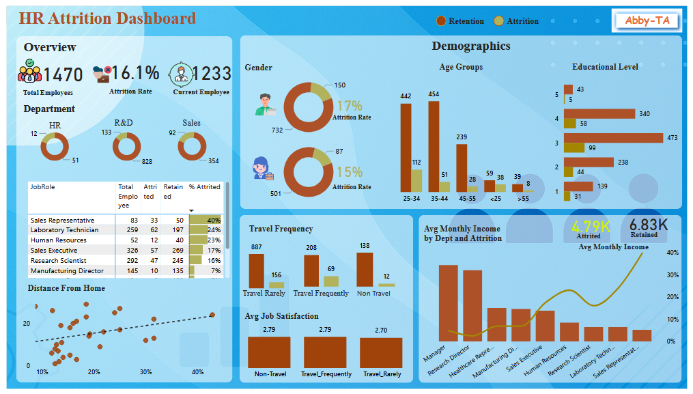
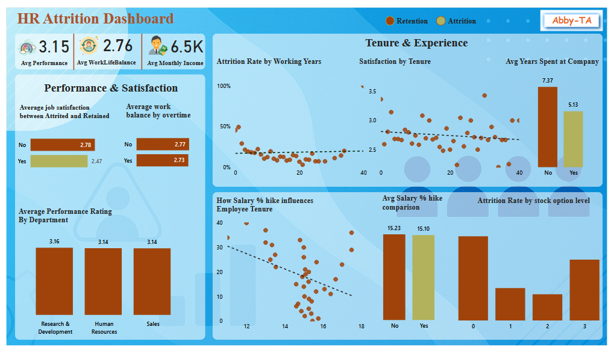

# HR_Attrition_Dashboard
A Power BI dashboard analyzing HR attrition data to identify workforce trends, risk factors, and retention opportunities across departments.

---

## 🔍 Overview

This project explores HR attrition data to uncover insights into why employees leave and what factors influence retention. The analysis focuses on key variables such as job satisfaction, age, salary, and work environment.

**Key objectives include:**
- Understanding employee turnover trends.
- Identifying departments with high attrition.
- Exploring demographic and role-based attrition patterns.
- Evaluating the impact of satisfaction and salary on attrition.
- Providing data-driven recommendations to improve retention.

---

## 🧠 Tools & Skills Demonstrated
- **Power BI:** Dashboard design, DAX measures, and interactive visuals.  
- **Data Analysis:** Employee turnover insights and KPI tracking.  
- **Storytelling:** Translating HR data into actionable business insights.  

---

## 🖼️ Dashboard Snapshots

| Overview Dashboard | Performance Dashboard |
|--------------------|------------------------|
|  |  |

---

## 🚀 How to Use
1. Clone or download the repository.  
2. Open the `HR_Attrition_Dashboard.pbix` file in **Power BI Desktop**.  
3. Explore visuals and filters to interact with attrition insights.  
4. Review the recommendations section to understand key findings.

---

## 📊 Insights Highlight
- Majority of attrition occurs among employees aged **26–35**.  
- **Sales and HR** departments record the highest attrition rates.  
- Job satisfaction and salary level have a **strong influence** on turnover.  
- Employees with longer tenure show higher retention stability.  
- Performance ratings correlate with attrition likelihood.

---

## 💡 Recommendations
- Improve engagement and recognition programs for mid-career employees.  
- Review compensation competitiveness, especially in high-turnover roles.  
- Strengthen onboarding, mentorship, and career growth programs.  
- Conduct regular satisfaction surveys to proactively identify disengagement.  
- Use performance data to flag and support at-risk employees early.  

---

## 🧾 Conclusion
This dashboard helps HR and management teams visualize employee attrition, identify problem areas, and make data-driven decisions to enhance retention and workforce stability.  
By turning HR data into actionable insights, the project demonstrates the power of **business intelligence** in workforce planning and employee engagement strategy.

---

## 📎 Files Included
- `HR_Attrition_Dashboard.pbix` - Power BI file  
- `README.md` - Documentation  
- `images/overview_dashboard.png`  
- `images/performance_dashboard.png`  

---

## 🧑‍💻 About the Author

**Abiodun Olofingbemi**  
Data Analyst | Power BI | SQL | Excel | Business Intelligence  

I’m passionate about turning raw data into clear insights that drive business impact.  
This project is part of my analytics portfolio, showcasing my ability to blend storytelling with data-driven decision-making.

📫 **Connect with me:**  
- **LinkedIn:** [linkedin.com/in/olofingbemi-abiodun](https://www.linkedin.com/in/olofingbemi-abiodun/)  
- **Email:** abiodunolofingbemi2@gmail.com  

---

## 🏷️ Tags
`#PowerBI` `#HRAnalytics` `#AttritionAnalysis` `#DataVisualization` `#BusinessIntelligence`
